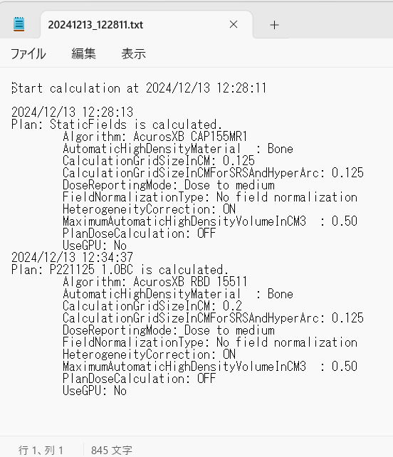

# calculate_test_plans

現在のコース内の未計算プラン全ての線量計算を行うためのスクリプトです。

ESAPI v16.1で作成されています。

本ソフトウェアの多言語への翻訳は途中です。

## 使用方法

1. スクリプトを実行すると、未計算プランと、計算の進行状況を出力するテキストファイルのパスが表示されます。

   

2. 以下に示すボタンをクリックすることで、現在のコース内の未計算プラン全ての線量計算が実行されます。線量計算パラメータは事前に適切な値に設定される必要があります（線量計算アルゴリズムなど）。

   - Yes → 線量を計算し、全fieldのfield weightが1.000に設定される。
   - No → 線量を計算し、全fieldのfield weightはスクリプト実行前の値に保持される。
   - Cancel → 線量計算を実行しない。

3. スクリプト実行中、計算ログファイルは更新され続けます。

   

## LICENSE

MIT ライセンスで公開されています。

本ソフトウェアで発生したことについて、いかなる責任も負いません。

詳細は [LICENSE](https://github.com/akiaji-k/4DCT_namer/blob/main/LICENSE) をご確認ください。